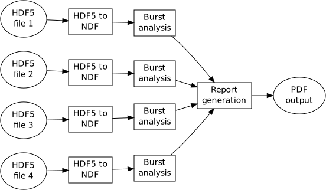

<style>
h2 { 
 color: #3399ff;		
}
h3 { 
 color: #3399ff;		
}
</style>


## Introduction

- These slides demonstrate how to use *rmarkdown* package to make
slides.

- There are several routes to building slides.  I went with
  rmarkdown/ioslides as it seemed cleanest to my tastes.  *reveal.js*
  is another popular option.


## Why switch slide-making tool? | Isn't beamer good enough?

- For many years, I used latex+beamer.  To present the slides, I used
pdftokeynote, and then keynote to display the images as I like seeing
"next slide" on my laptop.

- I  missed having a "notes" feature on my display.

- I couldn't embed movies into my talks when using the above route to
keynote.

- So, I thought I'd try out an HTML presentation system.


## Slides with notes

On this page you will see some example notes in the presenter window.


<div class="notes">
These are some example notes in *markdown* format.

- List items can be included

- Like this
</div>

----

- Slides without headers can be made by using four dash separator.

- Otherwise two hashes will get you a new slide with a heading.

- One hash will get you a section divider (with a different background
colour).

## R markdown

- The Rmarkdown package is great.  It provides a simple way to make
html slides. I prefer the ioslides format demonstrated in this [video](https://www.youtube.com/watch?v=WRvECXyWj80)

- You can read the
  [ioslides documentation](http://rmarkdown.rstudio.com/ioslides_presentation_format.html).
  
- There is also a great [cheat sheet](http://shiny.rstudio.com/articles/rm-cheatsheet.html).

## Presentation tips | a few pointers

- The ioslides format hard-codes the slides to 1024x768.  You can
  always press "f" for fullscreen and then use the zoom features in
  the web browser to enlarge the slides.

- Add presentme=true to your url to bring up the presentation window.
  The presentation window is a "popup" window so if you don't see it,
  check if your browser is blocking popups.

- If you change slides from the presentation window, the main window
will change accordingly.  However, if you change slides from the main
window (e.g. on the data projector), the presentation window will not
update.  This is bug, filed on github.


## Figures 1

- PNG or other bitmaps can be included.  SVG can be included if your
  browser supports it.  This page shows an SVG file.



## Figures 2

However, if you want to centre/rescale images, you must switch to
html tag:

<center></center>


## Dynamic R

The following figure is generated when the presentation is compiled:


```{r eval=TRUE}
hist(rnorm(1e7), main=date())
```

## Movies

Check your browser if it supports your file format. I found (on
firefox) is that file.mov did not play, but renaming it to file.mp4
worked. mp4/mov seems best cross-browser.  Here is an example movie;
see tags for controlling autoplay etc.

<center>
<video id="sampleMovie1" src="./figs/p11ctrlconv.mov" loop="true" autoplay="true" controls></video>
</center>

## Mathjax

Mathjax is supported, so with latex syntax you can get inline  \(A = \pi
\times r^2 \) or separate maths:

\[
\begin{aligned}
I_{1} &= \int_{0}^{2*\pi} \sin(x)
\\
I_{2} &= \int_{0}^{2*\pi} \cos(x)
\end{aligned}
\]

[Further details](https://support.rstudio.com/hc/en-us/articles/200486328-Equations-in-R-Markdown)

## Tables

Simple tables can be included.  More complicated ones could be output
from xtable() in R:


Table Header  | Second Header
------------- | -------------
Table Cell    | Cell 2
Cell 3        | Cell 4
Cell 5        | Cell 6


## Citations

Citations can be included in your talk, with a "References" slide at
the end.  For example, @Xie2013 and @Gentleman2004.

[documentation](http://rmarkdown.rstudio.com/authoring_bibliographies_and_citations.html)

# What's next?


## What's missing?

- Probably hard to fine-tune the positioning of elements on a given
slide.


## Useful references

Some other presentations, together with source Rmd files:

1. [Reactive programming in R](https://jcheng.shinyapps.io/reactivity-dsc2014/#1) [(source)](https://github.com/jcheng5/shiny-dsc2014/blob/master/scratch.Rmd)

2. [New developments in knitr and R Markdown v2](https://dl.dropboxusercontent.com/u/15335397/slides/LARUG-2014-Yihui-Xie.html#1)
   [(source)](https://www.dropbox.com/s/ir17ny1crx5fwq6/LARUG-2014-Yihui-Xie.Rmd)

3. [Packrat](http://rpubs.com/jjallaire/packrat-useR-2014) [(source)](https://github.com/jjallaire/packrat-useR-2014/blob/master/packrat-slides.Rmd)

## Compiling this document

These slides are available on github.  You will need the *rmarkdown*
package and [pandoc](http://johnmacfarlane.net/pandoc/).  You can
compile them using:

```{r eval=FALSE}
rmarkdown::render("ioslidesexample.Rmd")
```
or use the Makefile.


## Updates

- Line-spacing issue fixed in rmarkdown (end July 2014).  You may need
  to install dev version of rmarkdown using

```{r eval=FALSE}
devtools::install_github("rstudio/rmarkdown")
```


## References
